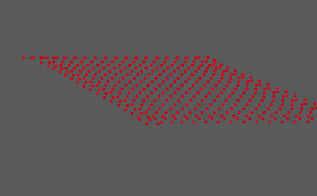
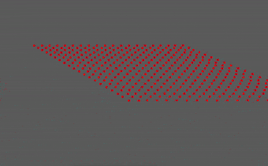

# atlas-examples
Suite of simple examples showcasing the Atlas framework.

# Getting Started

## Requirements
- GLX core profile version: 4.1+ (It was ONLY works for 4.3+, with the help of [@marovira](https://github.com/marovira), it is now supported 4.1+)

Here is my version of OpenGL on my laptop that works.
```
poanchen@Baron-Lenovo-IdeaPad-Y510P:~/atlas-examples$ glxinfo | grep "version"
server glx version string: 1.4
client glx version string: 1.4
GLX version: 1.4
    Max core profile version: 4.5
    Max compat profile version: 3.0
    Max GLES1 profile version: 1.1
    Max GLES[23] profile version: 3.1
OpenGL core profile version string: 4.5 (Core Profile) Mesa 17.0.7
OpenGL core profile shading language version string: 4.50
OpenGL version string: 3.0 Mesa 17.0.7
OpenGL shading language version string: 1.30
OpenGL ES profile version string: OpenGL ES 3.1 Mesa 17.0.7
OpenGL ES profile shading language version string: OpenGL ES GLSL ES 3.10
```

## Installation

```
git clone --recursive https://github.com/poanchen/atlas-examples.git
cd atlas-examples/
cmake CMakeLists.txt
make
```

## Usage

To make just simple-animation program,
```
make simple-animation
```

To run the simple-animation program,
```
./examples/simple-animation/simple-animation
```

## Demo




